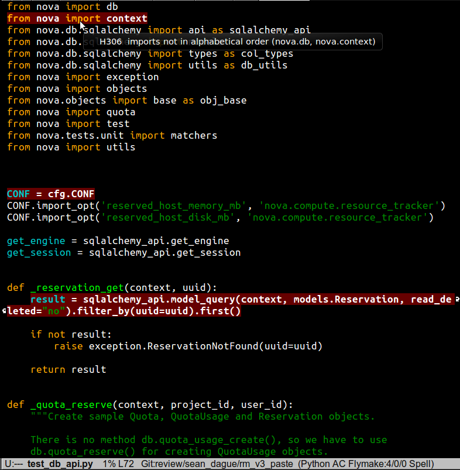

==================================================
 fly-hack - OpenStack hacking support for flymake
==================================================

Emacs has a built in inbuffer syntax checker called ``flymake``. On
every substantial buffer change it runs a syntax checker script and
highlights incorrect lines in the code. There is plenty of
documentation out there for setting up flake8 as the flymake checker
for python, which is a great first step.

However, in OpenStack there are a lot of projects. Every project
enforces a different level of flake8 through custom ignores. We also
extend flake8 with additional rules from the ``hacking``
project. Which, again, some projects ignore. We also allow projects to
build their own in tree hacking rules.

Would it be possible to make the flymake flake8 integration respect
and adapt to all of these rules? So that every flymake error is a real
error for that project, one that will bounce your code?

The answer seems to be yes, and is this project.

WARNING
=======

First some warnings. This code is very much in a *works for me*
state. Suitability for anyone else is unknown.

While I'm a long time emacs user, I'm a poor elisp coder, so I expect
a bunch of this to be in barely working state.

Pull requests are welcomed, as long as it doesn't break my config.

Installation
============

- cp fly-hack.el to some part of your elisp tree where it can be
  loaded from
- add the following to your .emacs::

    ;;; flymake base mode is availabe in emacs
    (require 'flymake)
    ;;; currently the helper has some logic based on the temp
    ;;; directory being the following
    (setq temporary-file-directory "~/.emacs.d/tmp/")
    (require 'fly-hack)
    ;;; set to the path where fly-hack.py lives. It needs to be a
    ;;; writable directory for it's fallback flake8.
    (setq fly-hack-helper "~/code/fly-hack/fly-hack.py")

- evaluate said buffer, open a python file, and you should be off and
  running.

Theory of Function
==================

Given that all of this may break horribly for you, let me explain what
it's *supposed to do* in the hopes that you can figure out why it
might not be working for you.

This mode disables flymake in place syntax checking, and instead
relies on copying the active buffers to a full path in a temporary
directory. The reason for this is to play nicely with tramp, which
lets you open files over an ssh connection. I edit locally for unit
test level things, but remotely when working on live devstacks. The
tramp support isn't first class, but at least it doesn't hang or throw
errors.

The bulk of the work is done by the custom flymake helper
``fly-hack.py``. This attempts to do the following things:

- figure out where in your local directory structure the editted file
  might be.
- ascend the directory tree looking for a .tox/pep8 directory, which
  means we'll have a localized flake8 (+ hacking + local rules) ready
  to go. If we find that, use that flake8 for our syntax run.
- if we don't find a flake8, make one. This is done by creating a
  .venv in the same directory as ``fly-hack.py`` and installing flake8
  into it. We only do this once, so if results start looking weird,
  you can delete the .venv and let it build it again.
